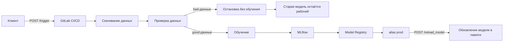

# MLOps Password Frequency Service

Автоматический MLOps-пайплайн для сервиса предсказания частоты паролей.

Проект реализует полный цикл работы с ML-моделью: от получения новых данных и проверки их качества до обучения модели, регистрации в MLflow, переключения продакшен-версии и обновления HTTP-сервиса без ручного вмешательства.

## Кратко о проекте

Сервис принимает список паролей и возвращает предсказанную частоту для каждого пароля.

Главная особенность проекта — модель умеет автоматически обновляться при появлении новых данных:

1. внешний клиент отправляет ссылку на новые данные в `/trigger`;
2. сервис запускает обучающий пайплайн в GitLab CI/CD;
3. пайплайн скачивает данные;
4. проверяет их качество;
5. если данные корректные — обучает новую модель;
6. регистрирует модель в MLflow;
7. переключает alias `prod` на новую версию;
8. вызывает `/reload_model`;
9. сервис начинает использовать новую модель для предсказаний.

Если данные некорректные, новая модель не обучается, alias `prod` не меняется, а сервис продолжает работать на предыдущей стабильной версии.

---

## Что демонстрирует проект

Этот проект показывает практическое владение базовым MLOps-контуром:

* разработка HTTP-сервиса для ML-модели на FastAPI;
* строгая схема входных и выходных данных через Pydantic;
* загрузка продакшен-модели из MLflow Model Registry;
* кеширование модели в памяти сервиса;
* запуск переобучения через отдельный endpoint;
* автоматический GitLab CI/CD pipeline;
* проверка качества входящих данных перед обучением;
* обучение модели только на новых данных;
* регистрация модели в MLflow;
* переключение alias `prod`;
* автоматическое обновление модели в работающем сервисе;
* Docker-сборка;
* деплой на Amvera;
* тесты и линтинг в CI/CD.

---

## Архитектура

### Обычное предсказание


### Переобучение



---

## Структура проекта

```text
mlops-password-frequency-service
├── .gitlab-ci.yml
├── Dockerfile
├── README.md
├── requirements.txt              # указатель на профильные requirements-файлы
├── requirements-app.txt          # Docker/runtime сервиса
├── requirements-train.txt        # training job
├── requirements-dev.txt          # lint/test/local development
├── .env.example
├── app
│   ├── gitlab_trigger.py
│   ├── main.py
│   ├── model_loader.py
│   └── schemas.py
├── training
│   ├── download_data.py
│   ├── entropy.py
│   ├── register_model.py
│   ├── run_pipeline.py
│   ├── train_model.py
│   └── validate_data.py
└── tests
    ├── test_predict.py
    └── test_validation.py
```

### Назначение основных папок

`app/` — код HTTP-сервиса.

`training/` — код обучающего пайплайна.

`tests/` — тесты API и проверки данных.

`.gitlab-ci.yml` — автоматизация проверки, сборки, деплоя и обучения.

`Dockerfile` — инструкция по сборке Docker-образа.

`requirements-app.txt` — зависимости для Docker/runtime сервиса.

`requirements-train.txt` — зависимости для обучающего pipeline.

`requirements-dev.txt` — зависимости для lint/test/local development.

`requirements.txt` — только указатель на профильные requirements-файлы, не универсальный production/runtime список зависимостей.

`.env.example` — шаблон переменных окружения.

---

## API сервиса

### 1. Предсказания

`POST /predict`

Принимает список паролей и возвращает список предсказанных значений `Times`.

#### Пример запроса

```bash
curl -X POST "https://your-amvera-service.amvera.ru/predict" \
  -H "Content-Type: application/json" \
  -d '{"Password": ["qwerty123", "admin", "helloWorld2024"]}'
```

#### Пример ответа

```json
{
  "Times": [0.123, 0.456, 0.789]
}
```

Важно: формат входа и выхода строгий.

Вход:

```json
{
  "Password": ["pass1", "pass2"]
}
```

Выход:

```json
{
  "Times": [0.1, 0.2]
}
```

---

### 2. Запуск переобучения

`POST /trigger`

Принимает ссылку на новый CSV-файл с данными и запускает обучающий pipeline в GitLab CI/CD.

#### Пример запроса

```bash
curl -X POST "https://your-amvera-service.amvera.ru/trigger" \
  -H "Content-Type: application/json" \
  -d '{"data_url": "https://example.com/new_password_data.csv"}'
```

#### Пример ответа

```json
{
  "status": "started"
}
```

Эндпоинт не ждёт завершения обучения. Он только запускает pipeline и быстро возвращает ответ.

---

### 3. Диагностика модели

`GET /health`
`GET /model_state`
`GET /model_status`

Возвращают текущий статус сервиса и метаданные загруженной модели.

`/model_status` является read-only alias для `/model_state` и возвращает тот же диагностический payload.

#### Пример запроса

```bash
curl -X GET "https://your-amvera-service.amvera.ru/model_status"
```

#### Пример ответа

```json
{
  "status": "ok",
  "model_loaded": true,
  "model_name": "passwords",
  "model_alias": "prod",
  "loaded_version": "12",
  "model_uri": "models:/passwords@prod",
  "loaded_at": "2026-06-05T00:00:00+00:00",
  "last_reload_status": "success",
  "last_reload_error": null
}
```

---

### 4. Перезагрузка модели

`POST /reload_model`

Внутренний endpoint для обновления модели в работающем сервисе.

Обычно его вызывает GitLab CI/CD после успешного обучения и регистрации новой модели в MLflow.

#### Пример запроса

```bash
curl -X POST "https://your-amvera-service.amvera.ru/reload_model" \
  -H "X-Service-Token: your-secret-token"
```

#### Пример ответа

```json
{
  "status": "model_reloaded"
}
```

---

## Формат обучающих данных

Новые данные должны приходить в виде таблицы с двумя обязательными колонками:

```text
Password
Times
```

### Пример CSV

```csv
Password,Times
qwerty123,12345
admin2024,923
helloWorld,5012
```

### Требования к данным

Колонка `Password`:

* должна существовать;
* не должна содержать пропуски;
* должна содержать строки;
* строки не должны быть пустыми.

Колонка `Times`:

* должна существовать;
* должна быть числовой;
* не должна содержать пропуски;
* не должна содержать бесконечности;
* значения должны быть больше нуля.

Если данные не проходят проверку, обучение не запускается.

---

## ML-пайплайн

Модель решает задачу регрессии: по строке пароля предсказывает значение `Times`.

Используется классический sklearn-пайплайн:

```text
Password
→ символьные n-граммы
→ TF-IDF
→ энтропия строки
→ объединение признаков
→ Ridge-регрессия
→ предсказание Times
```

### Основные шаги обучения

1. Скачать новые данные по `DATA_URL`.
2. Проверить структуру и качество данных.
3. Преобразовать `Times` через `log10`.
4. Обучить модель на новых данных.
5. Посчитать метрики.
6. Залогировать параметры и метрики в MLflow.
7. Сохранить модель в MLflow.
8. Зарегистрировать модель в Model Registry.
9. Назначить новой версии alias `prod`.
10. Вызвать `/reload_model` у сервиса.

---

## Проверка качества данных

Перед обучением выполняется два уровня проверки.

### 1. Базовая проверка через pandas

Проверяется:

* файл доступен;
* файл читается как CSV;
* таблица не пустая;
* есть колонки `Password` и `Times`;
* нет пропусков в обязательных колонках;
* `Password` содержит непустые строки;
* `Times` можно привести к числу;
* `Times` больше нуля;
* нет бесконечных значений.

### 2. Проверка через Evidently

Дополнительно запускается набор тестов качества данных:

* количество строк больше нуля;
* нет пустых строк;
* нет пустых колонок;
* нет дублированных колонок;
* доля пропущенных значений находится в допустимых границах.

Результаты проверки сохраняются в артефакты GitLab CI/CD.

---

## MLflow Model Registry

Модель регистрируется в MLflow под именем:

```text
your-username-mlops-project-model
```

Продакшен-версия определяется через alias:

```text
prod
```

Сервис загружает модель именно по alias `prod`.

Это позволяет не хранить модель внутри Docker-образа. Docker-образ содержит только код сервиса, а актуальная модель хранится в MLflow.

---

## Первичная инициализация модели

До финальной проверки LMS в MLflow Model Registry уже должна существовать первая рабочая модель, зарегистрированная под значением переменной `MODEL_NAME`, а alias `prod` должен указывать на её актуальную версию.

Сервис загружает модель из MLflow именно по alias `prod`, поэтому без начальной модели endpoint `/predict` не сможет работать корректно: сервису будет нечего загрузить для выполнения предсказаний.

### Шаги первичной инициализации

1. Подготовить стартовый CSV с колонками:

   * `Password`
   * `Times`

2. Сделать CSV доступным по URL или временно передать ссылку через переменную окружения `DATA_URL`, например:

   ```text
   DATA_URL=https://example.com/start-data.csv
   ```

3. Запустить training pipeline вручную через GitLab UI или через endpoint/trigger `POST /trigger`.

4. Убедиться в MLflow, что:

   * модель зарегистрирована под значением `MODEL_NAME`;
   * alias `prod` указывает на последнюю версию.

5. Проверить endpoint `POST /predict` с телом вида:

   ```json
   {"Password": ["qwerty", "123456"]}
   ```

   и убедиться, что ответ соответствует формату:

   ```json
   {"Times": [0.1, 0.2]}
   ```

---

## Repository / deployment workflow

### Source of truth для CI/CD

Source of truth для кода, CI/CD и финальной версии сервиса — GitLab-репозиторий проекта. Именно GitLab pipeline должен запускать проверки, собирать Docker image и обновлять конфигурацию деплоя.

GitHub может использоваться как зеркало, архив или публичная витрина проекта, но не должен считаться источником финального production-деплоя, если изменения не синхронизированы с GitLab.

### Единственный deployment artifact

Единственный deployment artifact проекта — DockerHub image:

```text
$DOCKERHUB_USERNAME/mlops-password-frequency-service:<tag>
```

Pipeline по push публикует в DockerHub два тега одного и того же образа:

* `${CI_COMMIT_SHORT_SHA}` — конкретная immutable-версия, привязанная к commit в GitLab; именно этот tag записывается в `amvera.yml` как `run.image` и определяет конкретную версию деплоя;
* `latest` — удобный alias на тот же образ для ручных проверок и диагностики, но не source of truth для Amvera deployment.

Код, локальные файлы и содержимое GitHub-репозитория сами по себе не являются deployment artifact. Для проверки production-версии нужно смотреть, какой DockerHub image/tag запущен в Amvera: конкретная версия деплоя определяется tag `${CI_COMMIT_SHORT_SHA}` из GitLab pipeline.

### Роль Amvera

Amvera не должна самостоятельно собирать исходный код проекта. В `amvera.yml` должен быть включён режим `build.skip: true`, а запуск должен происходить из Docker image, собранного GitLab pipeline и опубликованного в DockerHub.

Ожидаемая схема деплоя:

```text
GitLab commit -> GitLab CI/CD -> DockerHub image -> Amvera run.image -> сервис
```

Если Amvera начинает собирать код из своего Git-репозитория напрямую, это нарушает workflow проекта: появляется риск запустить не тот commit, не пройти GitLab checks или проверить версию, которая не совпадает с DockerHub image.

### Локальный workflow перед финальной сдачей

Перед финальной сдачей и проверкой LMS нужно выполнить один и тот же контрольный сценарий:

1. Запушить финальные изменения в GitLab-репозиторий, который является source of truth для CI/CD.
2. Дождаться успешного GitLab pipeline по push: `lint`, `format`, `test`, `build` и `deploy` должны завершиться без ошибок.
3. Проверить в DockerHub, что появился ожидаемый tag образа:

   * `${CI_COMMIT_SHORT_SHA}` для финального commit;
   * `latest` как удобный alias на тот же образ.

4. Проверить в Amvera, какой image/tag реально используется в `run.image`. Он должен указывать на DockerHub image, собранный GitLab pipeline, с tag `${CI_COMMIT_SHORT_SHA}` финального commit, а не на `latest`.
5. Проверить endpoint сервиса после деплоя, например:

   ```bash
   curl -X POST "https://your-amvera-service.amvera.ru/predict" \
     -H "Content-Type: application/json" \
     -d '{"Password": ["qwerty", "123456"]}'
   ```

   Ответ должен соответствовать контракту API:

   ```json
   {"Times": [0.1, 0.2]}
   ```

> **Важно:** ручные изменения в GitHub или Amvera без последующей синхронизации с GitLab могут привести к тому, что LMS проверит старую версию сервиса. Перед сдачей всегда сверяйте GitLab commit, DockerHub tag `${CI_COMMIT_SHORT_SHA}`, `run.image` в Amvera и фактический ответ endpoint.

---

## CI/CD pipeline

В проекте используется два типа pipeline.

---

### 1. Pipeline по push

Запускается при изменении кода.

Шаги:

```text
lint
format
test
build
deploy
```

Что происходит:

1. `ruff check` проверяет качество кода;
2. `ruff format --check` проверяет форматирование;
3. `pytest` запускает тесты;
4. Kaniko собирает Docker-образ;
5. Docker-образ пушится в DockerHub;
6. generated `amvera.yml` с `run.image: ${DOCKER_IMAGE}:${CI_COMMIT_SHORT_SHA}` пушится в Amvera и сервис обновляется.

---

### 2. Pipeline по trigger

Запускается из endpoint `/trigger`.

Шаги:

```text
download data
validate data
train model
register model
reload service model
```

Что происходит:

1. GitLab получает переменную `DATA_URL`;
2. скачивает новые данные;
3. проверяет данные;
4. если данные плохие — pipeline завершается без обучения;
5. если данные хорошие — обучает новую модель;
6. регистрирует модель в MLflow;
7. переключает alias `prod`;
8. вызывает `/reload_model`;
9. сервис начинает использовать новую модель.

---

## Переменные окружения

Для локального запуска создай `.env` на основе `.env.example`.

```bash
cp .env.example .env
```

Заполни значения:

```env
MLFLOW_TRACKING_URI=
MLFLOW_TRACKING_USERNAME=
MLFLOW_TRACKING_PASSWORD=
MLFLOW_S3_ENDPOINT_URL=
AWS_ACCESS_KEY_ID=
AWS_SECRET_ACCESS_KEY=

MODEL_NAME=your-username-mlops-project-model
MODEL_ALIAS=prod

GITLAB_URL=
GITLAB_PROJECT_ID=
GITLAB_REF=main
GITLAB_TRIGGER_TOKEN=

# Для запуска pipeline из `/trigger` нужен только GitLab pipeline trigger token.
# `GITLAB_TOKEN` / project access token не используется сервисом и не должен
# добавляться в `.env` или Amvera env variables для этого сценария.

SERVICE_RELOAD_URL=
SERVICE_RELOAD_SECRET=
```

Никогда не коммить `.env` в репозиторий.

### Минимальные GitLab credentials для `/trigger`

`POST /trigger` запускает GitLab pipeline напрямую через endpoint `POST /projects/:id/trigger/pipeline` и передаёт `DATA_URL` как pipeline variable. Для этого сценария сервису нужны только:

* `GITLAB_URL` — URL GitLab instance;
* `GITLAB_PROJECT_ID` — numeric project id или path проекта вида `group/project` (сервис сам URL-encodes path);
* `GITLAB_REF` — ветка/tag для запуска, по умолчанию `main`;
* `GITLAB_TRIGGER_TOKEN` — GitLab pipeline trigger token из **Settings → CI/CD → Pipeline trigger tokens**.

`GITLAB_TOKEN` и GitLab project access token сервису больше не нужны. Не добавляй `GITLAB_TOKEN` в Amvera env variables для запуска `/trigger`. Если отдельный процесс всё-таки использует GitLab Project Access Token, выдай ему отдельный least-privilege token и не включай scopes `create_runner`, `manage_runner`, `k8s_proxy`, `write_repository`, `read_registry`, `write_registry`, `ai_features`, если они явно не требуются этому отдельному процессу.

---

## Локальный запуск

### 1. Создать виртуальное окружение

```bash
python -m venv venv
```

### 2. Активировать окружение

Windows:

```bash
venv\Scripts\activate
```

Linux / macOS:

```bash
source venv/bin/activate
```

### 3. Установить зависимости нужного профиля

Для запуска HTTP-сервиса локально установите runtime-зависимости сервиса:

```bash
pip install -r requirements-app.txt
```

Для запуска обучающего pipeline установите training-зависимости:

```bash
pip install -r requirements-train.txt
```

Для разработки, линтинга и тестов установите dev-зависимости:

```bash
pip install -r requirements-dev.txt
```

### 4. Создать `.env`

```bash
cp .env.example .env
```

### 5. Запустить сервис

```bash
uvicorn app.main:app --host 0.0.0.0 --port 8000
```

Сервис будет доступен по адресу:

```text
http://localhost:8000
```

Swagger UI:

```text
http://localhost:8000/docs
```

---

## Запуск через Docker

### 1. Собрать образ

```bash
docker build -t mlops-password-frequency-service .
```

### 2. Запустить контейнер

```bash
docker run --rm -p 8000:8000 \
  --env-file .env \
  mlops-password-frequency-service
```

### 3. Проверить API

```bash
curl -X POST "http://localhost:8000/predict" \
  -H "Content-Type: application/json" \
  -d '{"Password": ["qwerty123", "admin"]}'
```

---

## Тесты

Запуск тестов:

```bash
pytest -q
```

Проверка линтером:

```bash
ruff check .
```

Проверка форматирования:

```bash
ruff format --check .
```

Автоформатирование:

```bash
ruff format .
```

---

## Скриншоты

### FastAPI / Swagger

Добавить скриншот после запуска сервиса:

```text
docs/screenshots/swagger.png
```

```markdown

```

### Amvera service

Добавить скриншот работающего сервиса на Amvera:

```text
docs/screenshots/amvera-service.png
```

```markdown

```

### GitLab CI/CD pipeline

Добавить скриншот успешного pipeline:

```text
docs/screenshots/gitlab-pipeline.png
```

```markdown

```

### MLflow Model Registry

Добавить скриншот зарегистрированной модели и alias `prod`:

```text
docs/screenshots/mlflow-model-registry.png
```

```markdown

```

---

## Что важно в реализации

Проект построен так, чтобы не переобучать модель внутри HTTP-запроса.

Endpoint `/trigger` только запускает внешний pipeline и быстро возвращает ответ. Это важно, потому что обучение может занимать время, а клиент не должен ждать завершения всего процесса.

Модель не хранится внутри Docker-образа. Сервис загружает актуальную продакшен-версию из MLflow по alias `prod`. Это позволяет обновлять модель без пересборки Docker-образа.

При невалидных данных новая модель не создаётся. Это защищает сервис от случайного переключения на плохую модель.

---

## Безопасное обновление модели

### Плохой сценарий

Без защитных проверок автоматическое обновление модели может привести к нежелательной ситуации:

* пришли новые данные;
* модель сразу переобучилась на этих данных;
* новая модель оказалась хуже предыдущей, но всё равно попала в production.

В таком сценарии автоматизация не защищает сервис, а наоборот ускоряет доставку плохой модели до пользователей.

### Как сделано в проекте

В текущей реализации обновление модели защищено проверкой входящих данных:

* новые данные сначала проходят валидацию;
* если данные плохие, обучение не запускается;
* если данные хорошие, модель обучается и регистрируется в MLflow;
* рабочая версия модели определяется alias `prod`.

Это защищает сервис от переобучения на некорректном CSV-файле и от случайной регистрации модели, построенной на плохих входных данных.

### Как можно усилить

Следующий шаг для более промышленного сценария — добавить проверку качества самой модели перед переключением production-версии:

* сравнивать новую модель со старой production-моделью;
* переключать alias `prod` только если новая модель не хуже старой по выбранным метрикам.

Такой подход позволит учитывать не только качество данных, но и качество результата обучения. В текущей реализации сравнение новой модели со старой перед переключением alias `prod` не реализовано.

---

## Ограничения текущей реализации

1. Проект фокусируется на MLOps-процессе, а не на подборе лучшей ML-модели.
2. Модель обучается только на новых данных, потому что так требует финальное задание.
3. В базовой версии новая модель переключается в `prod`, если данные прошли проверку.
4. Для промышленного сценария желательно добавить сравнение новой модели со старой перед переключением alias `prod`.
5. Сервис не хранит историю входящих запросов в базе данных.
6. Мониторинг реализован на уровне проверки новых обучающих данных, но не на уровне постоянного мониторинга всех production-запросов.

---

## Итог

Этот проект показывает полный базовый MLOps-цикл:

```text
данные
→ проверка качества
→ обучение модели
→ регистрация в MLflow
→ переключение prod-версии
→ обновление сервиса
→ предсказания через HTTP API
```

Главная цель проекта — не максимальное качество ML-модели, а построение автоматической и воспроизводимой системы доставки ML-моделей в сервис.
